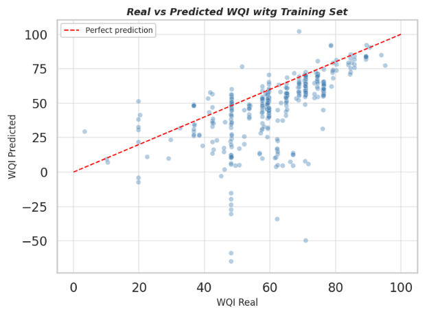

# Water quality prediction India

Project for the big data processing class at Javeriana. We took water quality data from rivers in India and tried to predict how clean the water is using a neural network.

## What I did

Got a dataset with mesurements from 534 stations in 18 states of India. Things like pH, oxygen levels, bacteria presence, etc. From those we calculate a score called WQI that tells you basically how clean or dirty the water is, then we trained a model to predict that score from the raw measurements.

Most of the data processing runs on PySpark (thats the point of the class) and the model is built with Keras.

## What I found

Punjab has the cleanest water relative to the rest. Kerala and Himachal Pradesh scored the worst, not because the water is dangerous but because its very hard water with a lot of minerals. Most states fall in the "very low" category which sounds bad but really just means mineralized water, not neccesarily contaminated.

Three states (Delhi, Chhattisgarh and Uttarakhand) had no valid data so their results dont count.

## About the model

I did it with 3 hidden layers, 350 neurons each, trained for 200 epochs. The loss drops super fast in the first 25 epochs and then basically flatlines.

The model takes the raw water measurements (DO, pH, conductivity, BOD, nitrates, fecal coliform) and tries to predict the WQI directly. The scatter plot below shows real vs predicted values on the training set the points follow the diagonal roughly but with visible dispersion, which makes sense given how small the dataset is (357 training samples) and how much natural variability there is between stations.

The model captures the general trend but struggles with extreme values, specially on the lower end. With more data and maybe some feature engineering it would probably do better.

## How to run

Install dependencies:

    pip install pyspark pandas numpy matplotlib geopandas keras tensorflow findspark scikit-learn seaborn adjustText

Run the notebook top to bottom, dont skip cells, pyspark keeps everything in memory between them.

## Repo structure

    |-- indian_states_map/
    |   |-- Indian_States.shp
    |   |-- Indian_States.shx
    |   |-- Indian_States.prj
    |   |-- Indian_States.dbf
    |-- .gitignore
    |-- LICENSE
    |-- README.md
    |-- water_quality_india_analytical_report.pdf
    |-- waterquality.csv

## License

MIT

## Author

Mariana Rodriguez Velandia
Data Science Student 5th Semester
